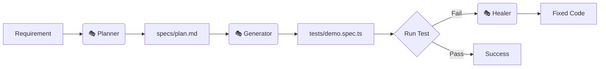

# 🎭 Playwright Agents - TodoMVC Demo

[](https://playwright.dev/)
[](https://www.typescriptlang.org/)
[](https://playwright.dev/docs/test-agents)

A hands-on guide to using Playwright's AI-powered **Planner**, **Generator**, and **Healer** agents to automatically generate, run, and fix tests for the [TodoMVC](https://demo.playwright.dev/todomvc) app.

---

## 🎯 What Are Playwright Test Agents?

Think of Playwright Agents as your AI testing assistants. Instead of writing tests manually, you describe what you want to test, and the agents handle the rest.

### The Agent Trio

| Agent | Role | Input | Output |
| :--- | :--- | :--- | :--- |
| **🎭 Planner** | **Explorer** | Requirements | Human-readable roadmap (`.md`) |
| **🎭 Generator** | **Builder** | Roadmap | Executable test code (`.spec.ts`) |
| **🎭 Healer** | **Maintainer** | Broken Test | Automatic patch and fix |

### Workflow Visualization



---

## 🚀 Quick Start (5 Minutes)

### 1. Setup

```bash
# Clone and install
git clone <your-repo-url>
cd playwright-agents-ts
npm install

# Initialize Agents (Choose your AI tool loop)
# For VS Code:
npx playwright init-agents --loop=vscode

# For Claude Code:
npx playwright init-agents --loop=claude
```

### 2. Configuration Check

Ensure your agents can talk to the browser via MCP (Model Context Protocol).

*   **Agents Folder**: `/.github/agents/` (Auto-generated)
*   **MCP Config**: `/.vscode/mcp.json`

> [!TIP]
> Your `mcp.json` should look like this for the agents to run correctly:
> ```json
> {
>   "servers": {
>     "playwright-test": {
>       "type": "stdio",
>       "command": "npx",
>       "args": ["playwright", "run-test-mcp-server"]
>     }
>   }
> }
> ```

---

## 🛠 Step-by-Step Guide

### Step 1: Create a Seed Test
The "Seed" test tells agents how to access your app. See [tests/seed.spec.ts](tests/seed.spec.ts).

### Step 2: Run the Planner 🎭
In your AI tool, ask the **Planner Agent**:
> "Create a test plan for the TodoMVC app covering: Adding, marking complete, filtering, and deleting todos. Reference: tests/seed.spec.ts"

### Step 3: Run the Generator 🎭
Ask the **Generator Agent**:
> "Generate Playwright tests for all scenarios in specs/todomvc-plan.md. Reference: tests/seed.spec.ts"

### Step 4: Run & Heal 🎭
1. Run tests: `npm test`
2. **Break it**: Change a text locator in a test file (e.g., `'1 item left'` to `'99 items'`).
3. **Heal it**: Ask the **Healer Agent**:
> "Fix the failing test: tests/<your-test-file>.spec.ts"

---

## 📁 Project Structure

```text
├── .github/agents/    # AI Agent instructions
├── specs/             # Markdown test plans (Planner output)
├── tests/             # Executable test files (Generator output)
├── pages/             # Page Object Models (Encapsulated logic)
├── fixtures/          # Custom test context/setup
└── playwright.config  # Global Playwright settings
```

---

## 🧪 Commands

| Command | Description |
| :--- | :--- |
| `npm test` | Run all tests (Headless) |
| `npm run test:headed` | Run tests with browser visible |
| `npm run test:ui` | Open Playwright UI Mode |
| `npm run report` | View detailed HTML report |

---

## 📚 Resources & Learning

*   [Detailed MCP Setup Guide](DOCS/MCP_GUIDE.md) - Deep dive into MCP servers.
*   [Official Playwright Agents Docs](https://playwright.dev/docs/test-agents)
*   [Model Context Protocol (MCP)](https://modelcontextprotocol.io)

---

## 🧱 Design Philosophy

1.  **Clean Specs**: Spec files describe *intent*, not implementation.
2.  **Smart Locators**: Using user-facing attributes (`getByRole`, `getByText`).
3.  **Autonomous Maintenance**: Let the Healer handle UI shifts automatically.

---

## License
MIT
